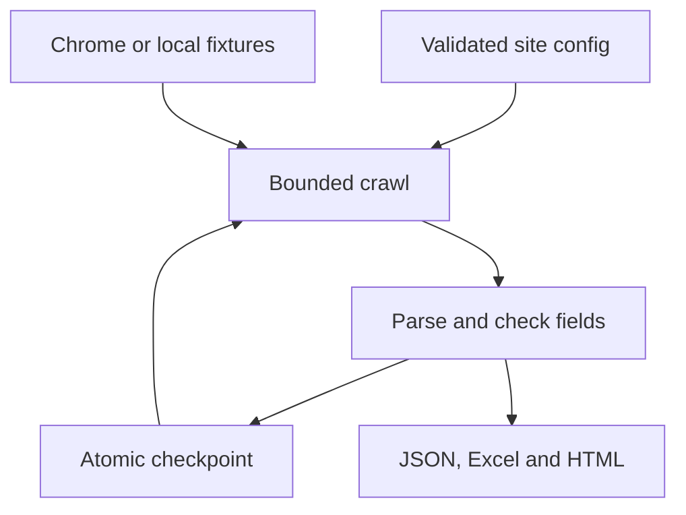

# Web Scraper · directory data automation

Turn paginated directories into structured records, a filterable Excel workbook and a searchable HTML review report. Configure a site's selectors in JSON, run a small sample, then resume larger runs from a checkpoint.

[](https://github.com/wahaaje/web-scrapper-demo/actions/workflows/tests.yml)


**[Run the demo](#run-the-local-demo) · [Configuration](docs/configuration.md) · [Architecture](docs/architecture.md) · [Operations](docs/operations.md)**

## Why this project

Copying directory entries into a spreadsheet is repetitive. A scraper can automate that work, but useful automation also needs to explain incomplete records, preserve source information and recover from interruptions.

This project brings those concerns into one small Python pipeline. The bundled demo makes its behavior inspectable without relying on a third-party website remaining unchanged.

## Run the local demo

Use **Python 3.11 or newer**. From the repository folder:

```bash
python -m venv .venv
```

Activate the environment:

| Platform | Command |
|---|---|
| Windows PowerShell | `.venv\Scripts\Activate.ps1` |
| Windows Command Prompt | `.venv\Scripts\activate.bat` |
| macOS / Linux | `source .venv/bin/activate` |

```bash
python -m pip install -r requirements.txt
python scraper.py --demo
```

After dependency installation, the demo runs **without Chrome or a network connection**. It reads fictional local HTML and uses the same discovery, parsing, validation, checkpoint and export code as live mode.

Expected result:

```text
Captured 3 records: 3 ok, 0 partial, 0 error.
Reused 0 successful record(s).
```

Open **`output/demo/report.html`** in a browser or **`output/demo/records.xlsx`** in Excel. Search the report, filter by status and expand the extracted sections. A ready-made [sample report](examples/output/report.html) is also included: download it and open it locally.

The demo covers **2 listing pages, 3 unique records and 10 data blocks**. Duplicate listing links are skipped; repeated section labels remain separate entries. Northstar Workshop has no email, demonstrating how an optional field stays empty.

| Record | Category | Data blocks | Result |
|---|---|---:|---|
| Atlas Studio | Design | 4 | Complete |
| Cedar Books | Retail | 3 | Complete |
| Northstar Workshop | Services | 3 | Complete; optional email absent |

These are test fixtures, not collected business leads or client results.

## What it handles

| Capability | Behavior |
|---|---|
| Configuration | JSON selectors, required fields, timeouts, pacing and listing-page limits |
| Pagination | Follows next-page `href` links, detects loops and deduplicates detail URLs |
| Browser automation | Headless or visible Chrome; explicit waits for configured page elements |
| Data quality | Distinguishes `ok`, `partial` and `error`; missing required fields are reported |
| Recovery | Saves each completed record atomically; resume skips successful records and retries incomplete ones |
| Traceability | Requested URL, final source URL, UTC timestamp, attempts and issues accompany each record |
| Export | Complete JSON, a three-sheet Excel workbook and a self-contained HTML report |
| Safe presentation | Extracted strings stay literal in Excel; page content is escaped in the HTML report |

## Adapt it to a website

The example configuration uses `example.com` as a placeholder. Replace its URL and selectors before live use.

```bash
python -c "import shutil; shutil.copyfile('examples/site-config.example.json', 'config.local.json')"
```

Edit `config.local.json`, then run a sample against a site you are authorized to automate:

```bash
python scraper.py --config config.local.json --limit 5 --output output/site-sample
```

Live mode uses Chrome and Selenium's built-in driver management. Driver setup may require network access on the first run. See [Selenium Manager](https://www.selenium.dev/documentation/selenium_manager/) for its setup behavior.

After inspecting the sample, expand the same run:

```bash
python scraper.py --config config.local.json --limit 200 --output output/site-sample --resume
```

For an intentionally fresh scrape, choose a new output directory or explicitly use `--overwrite`. Use `--headed` when inspecting a live site's selectors.

See [the configuration reference](docs/configuration.md) for the complete schema and [operations](docs/operations.md) for resume rules, exit codes and troubleshooting.

## Outputs

| File | Purpose |
|---|---|
| `records.json` | Canonical complete records, including every repeated data block |
| `records.xlsx` | Run summary, records and data blocks in separate sheets |
| `report.html` | Portable review page with search, status filtering and expandable sections |
| `run_report.json` | Counts, run timing, request attempts, stop reason and warnings |
| `checkpoint.json` | Configuration-bound recovery state |
| `scraper.log` | Local progress and timeout-retry log |

Long text or characters incompatible with Excel are adjusted only in the workbook and reported as warnings. JSON retains the full extracted values. The HTML report has no external scripts, fonts or analytics.

## Design



The browser is an adapter; parsing and run coordination can be tested without starting it. Repeated sections are stored as an ordered list instead of renaming labels or dropping everything after two blocks. [Read the engineering decisions](docs/architecture.md).

## Verification

```bash
python -m unittest discover -s tests -v
```

The tests cover pagination, source scope, configuration errors, missing fields, bounded timeout retries, interruption recovery, resume behavior, output protection, literal Excel strings and HTML escaping.

**Verified locally:** 36 tests and the full fixture demo on Python 3.12.14. The Selenium adapter is tested with a mocked driver. The included GitHub Actions workflow runs the suite and demo on Python 3.11 and 3.12 after upload; its live badge reports the repository's actual CI result.

**Live-site limitation:** no specific external directory is certified by this demo. Each site needs its own selector checks and sample run. Authentication, CAPTCHA handling, infinite scrolling, JavaScript-only pagination and extraction inside iframes or shadow roots need additional site-specific work. Text comes from an HTML snapshot; CSS visibility is not evaluated.

## About the author

**[Raja Wahaj](https://github.com/wahaaje)** · AI Automation Engineer · Founder, bitNode Solutions

I build workflow automation with a background in data engineering and analytics. This repository demonstrates browser automation and reliable data handoffs. It does not use an LLM.

Also see **[Meta Social Publisher Automation](https://github.com/wahaaje/meta-social-publisher-automation)** for a publishing workflow built around Google Sheets, Apps Script and the Meta API.
